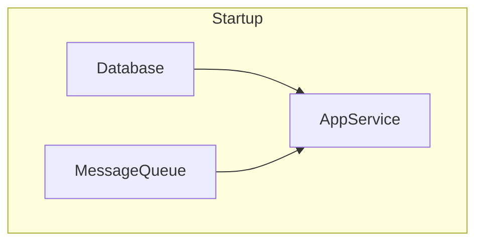
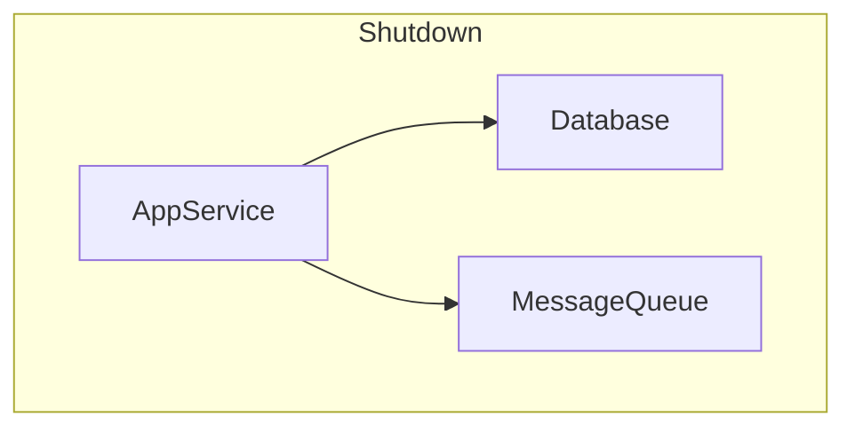

# Component: A Type-Safe Dependency Orchestration Library

**Component** provides a lightweight, type-safe framework for declaring, wiring, and orchestrating stateful services (e.g. database connections, message queues, HTTP servers) in Go.

Under the hood, components form a directed acyclic dependency graph. Each component is assigned a **level** based on the longest chain of dependencies beneath it:

- **Level 0**: no declared dependencies
- **Level N**: depends only on components at levels < N

When you call `Start`, the system brings up your application **level by level**:

1. **Level 0** all start in parallel.
2. Only once every level 0 component is running does it kick off **Level 1**, again in parallel.
3. And so on, ensuring that at each component’s prerequisites are available.

Shutdown (`Stop`) reverses this order automatically:

1. **Highest level** components stop first.
2. Once they’ve all shut down, the next lower level is torn down in parallel.
3. …down to Level 0.

If any component fails to start, **Component** will automatically roll back, stopping all already-started components.

---

## Installation

```bash
go get github.com/jacoelho/component
```

## Usage

Check the [example](./example_test.go)

## Startup & Shutdown Order

Below is a diagram illustrating the startup and shutdown sequence:



Startup:
- Level 0: Database and MessageQueue start in parallel. 
- Level 1: AppService starts once both Level 0 components are ready.




Shutdown:
- Level 1: AppService stops first.
- Level 0: Database and MessageQueue stop in parallel.

## Generating a Dependency Graph

The `DotGraph` method emits your system’s dependency graph in [Graphviz](https://graphviz.org/) DOT format, clustering components by their startup level and drawing directed edges from each dependency to its dependent.

```bash
dot := sys.DotGraph()
fmt.Println(dot)

// Save to file and render: dot -Tpng graph.dot > graph.png
```

```dot
digraph G {
  rankdir=TB;
  compound=true;
  subgraph cluster_0 {
    label="Level 0";
    style=dashed;
    "*component_test.Database";
    "*component_test.MessageQueue";
  }
  subgraph cluster_1 {
    label="Level 1";
    style=dashed;
    "*component_test.AppService";
  }
  "*component_test.Database" -> "*component_test.AppService";
  "*component_test.MessageQueue" -> "*component_test.AppService";
```