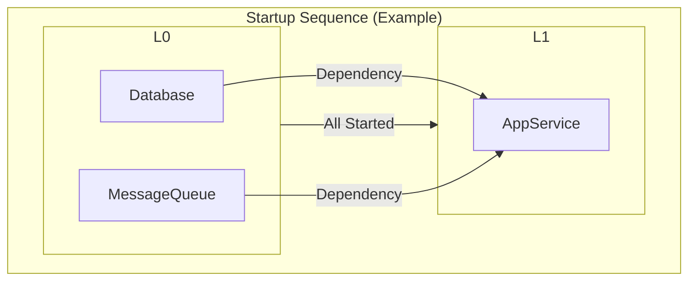

# Component: A Type-Safe Dependency Orchestration Library

Component provides a lightweight, type-safe framework for declaring, wiring, and orchestrating stateful services (e.g., database connections, message queues, HTTP servers) in Go.

It ensures that your application components start and stop in the correct order, with dependencies managed explicitly.

- Type-Safe: Leverages Go generics for defining and retrieving components.
- Runtime Validation: Dependency relationships, including cycles, are validated during component registration (Provide). Further validation for missing dependencies occurs before any component's Start method is invoked.
- Level-Based Orchestration: Components form a directed acyclic graph (DAG) and are assigned a level based on their dependencies:
  - Level 0: No declared dependencies.
  - Level N: Depends only on components at levels < N.
- Parallel Execution: Components at the same dependency level are started and stopped in parallel, maximizing efficiency while respecting order.
- Automatic Rollback: If any component fails to start, the system automatically rolls back by stopping all already-started components.
- Robust Shutdown: During shutdown, the system attempts to stop all components, even if some encounter errors, and aggregates any issues.

---

## Installation

```bash
go get github.com/jacoelho/component
```

## Usage

```go
package main

import (
  "context"
  "fmt"
  "log"
  "time"

  "github.com/jacoelho/component"
)

// 1. Define components
type Logger struct{}

func (l *Logger) Start(ctx context.Context) error { l.Log("Logger Started"); return nil }
func (l *Logger) Stop(ctx context.Context) error  { l.Log("Logger Stopped"); return nil }
func (l *Logger) Log(message string)              { fmt.Println(message) }

type MainService struct{ logger *Logger }

func (s *MainService) Start(ctx context.Context) error {
  s.logger.Log("MainService Started")
  return nil
}
func (s *MainService) Stop(ctx context.Context) error {
  s.logger.Log("MainService Stopped")
  return nil
}

func main() {
  sys := new(component.System)
  ctx := context.Background()

  // Create Keys
  var (
    loggerKey  component.Key[*Logger]
    serviceKey component.Key[*MainService]
  )

  // Provide components
  if err := component.Provide(sys, loggerKey, func(_ *component.System) (*Logger, error) {
    return &Logger{}, nil
  }); err != nil {
    log.Fatalf("Failed to provide logger: %v", err)
  }

  if err := component.Provide(sys, serviceKey, func(s *component.System) (*MainService, error) {
    logger, err := component.Get(s, loggerKey) // Get dependency
    if err != nil {
      return nil, err
    }
    return &MainService{logger: logger}, nil
  }, loggerKey); err != nil { // Declare dependency on loggerKey
    log.Fatalf("Failed to provide main service: %v", err)
  }

  // Start system
  fmt.Println("Starting system...")
  startCtx, cancel := context.WithTimeout(ctx, time.Second*5)
  defer cancel()
  if err := sys.Start(startCtx); err != nil {
    log.Fatalf("System start failed: %v", err)
  }

  fmt.Println("System is UP.")

  // Stop system
  fmt.Println("Stopping system...")
  stopCtx, cancel := context.WithTimeout(ctx, time.Second*5)
  defer cancel()
  if err := sys.Stop(stopCtx); err != nil {
    log.Printf("System stop encountered errors: %v", err)
  }
  fmt.Println("System shut down.")
}
```

For a more detailed, runnable example demonstrating multiple components and dependencies, see [example_test.go](./example_test.go).

## Startup & Shutdown Order

Components are managed in levels based on their dependencies.

### Startup

The system brings up your application level by level:

1. Level 0 components (no dependencies) all start in parallel.
2. Once all Level 0 components are running, Level 1 components start in parallel.
3. This continues until all levels are started, ensuring prerequisites are always available.



### Shutdown:

Stop reverses the startup order automatically:

1. Components at the highest level stop first, in parallel.
2. Once they've all shut down, the next lower level is torn down in parallel.
3. This continues down to Level 0. The system attempts to stop all components even if errors occur, aggregating any issues.

Using the example above, AppService (Level 1) would stop first. After it has completed its shutdown, Database and MessageQueue (Level 0) would stop in parallel.

## Generating a Dependency Graph

The `DotGraph` method emits your system's dependency graph in [Graphviz](https://graphviz.org/) DOT format, clustering components by their startup level and drawing directed edges from each dependency to its dependent.

```bash
dot := sys.DotGraph()

// Save to file and render: dot -Tpng graph.dot > graph.png
```

Example file:

```dot
digraph G {
  rankdir=TB;
  compound=true;
  subgraph cluster_0 {
    label="Level 0";
    style=dashed;
    "*component_test.Database";
    "*component_test.MessageQueue";
  }
  subgraph cluster_1 {
    label="Level 1";
    style=dashed;
    "*component_test.AppService";
  }
  "*component_test.Database" -> "*component_test.AppService";
  "*component_test.MessageQueue" -> "*component_test.AppService";
```

## Comparison with Other Solutions

Go offers several popular libraries for dependency injection and application lifecycle management. Here’s how **Component** compares:

| Library                                            | Approach                             | Compile-time Safety | Runtime Overhead | Lifecycle Orchestration     | Complexity |
|----------------------------------------------------|--------------------------------------|---------------------|------------------|-----------------------------|------------|
| [google/wire](https://github.com/google/wire)      | Static code generation               | ✅ High              | ⚪ Zero           | None (just DI wiring)       | Minimal    |
| [uber/dig](https://github.com/uber-go/dig)         | Reflection-based container           | ⚪ Medium            | ⚫ Moderate       | None                        | Moderate   |
| [uber/fx](https://github.com/uber-go/fx)           | `dig` + opinionated framework        | ⚪ Medium            | ⚫ Moderate       | ✅ Built-in start/stop hooks | High       |
| [component](https://github.com/jacoelho/component) | Level-based, type-safe orchestration | ✅ High              | ⚪ Low            | ✅ Parallel start/stop       | Minimal    |

- google/wire:
  - Uses compile-time code generation to wire dependencies, offering excellent safety and zero runtime DI overhead.
  - Requires maintaining wire.ProviderSet definitions and rerunning the wire tool. Does not manage lifecycles.
- uber/dig:
  - A powerful reflection-based DI container. Flexible and "plug-and-play."
  - Type safety relies on constructor signatures; errors caught when the container is built. Introduces some reflection overhead. Does not manage lifecycles.
- uber/fx:
  - Builds upon dig to provide a full application framework with modules, hooks, and lifecycle management.
  - Excellent for large, opinionated services but comes with a larger API surface and more abstractions.
- jacoelho/component (this Library):
  - Emphasizes minimalism, idiomatic Go (generics, simple interfaces), and explicit lifecycle control.
  - Provides type-safe component registration and retrieval.
  - Validates the dependency graph (cycles, missing dependencies) at runtime before starting components.
  - Orchestrates Start and Stop calls in parallel by dependency level, with automatic rollback on startup failures and robust shutdown.
