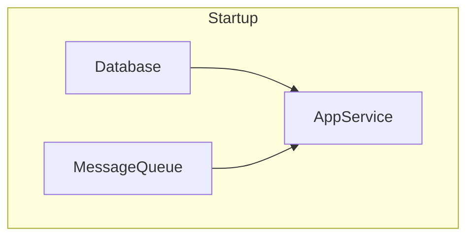
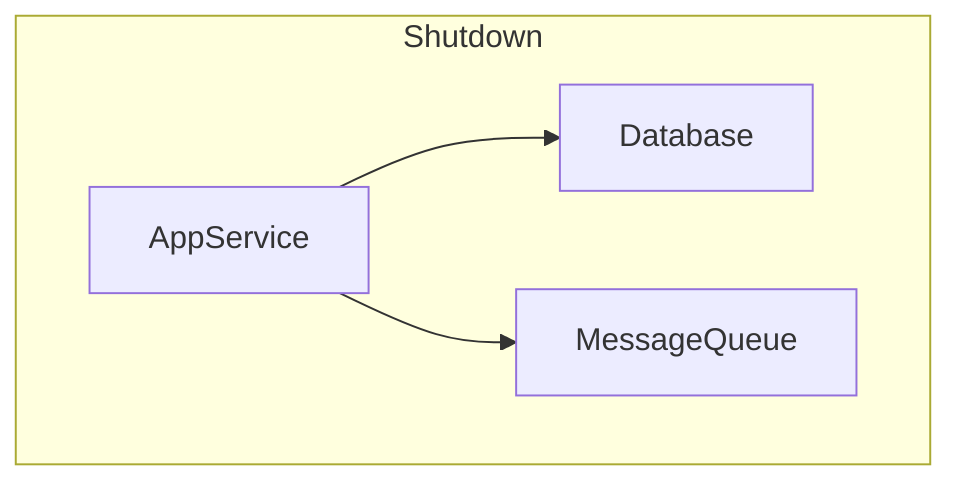

# Component: A Type-Safe Dependency Orchestration Library

**Component** provides a lightweight, type-safe framework for declaring, wiring, and orchestrating stateful services (e.g. database connections, message queues, HTTP servers) in Go.

All dependency relationships are **validated at runtime**, before any component is started to catch missing or cyclic declarations early. 

Internally, components form a **directed acyclic graph** (DAG) and are assigned a **level** equal to the length of the longest chain of dependencies beneath them:

- **Level 0**: no declared dependencies
- **Level N**: depends only on components at levels < N

When you call `Start`, the system brings up your application **level by level**:

1. **Level 0** all start in parallel.
2. Only once every level 0 component is running does it kick off **Level 1**, again in parallel.
3. And so on, ensuring that at each component’s prerequisites are available.

`Stop` reverses this order automatically:

1. **Highest level** components stop first.
2. Once they’ve all shut down, the next lower level is torn down in parallel.
3. …down to Level 0.

If any component fails to start, will automatically roll back, stopping all already-started components.

---

## Installation

```bash
go get github.com/jacoelho/component
```

## Usage

Check the [example](./example_test.go)

## Startup & Shutdown Order

Below is a diagram illustrating the startup and shutdown sequence:



Startup:
- Level 0: Database and MessageQueue start in parallel. 
- Level 1: AppService starts once both Level 0 components are ready.




Shutdown:
- Level 1: AppService stops first.
- Level 0: Database and MessageQueue stop in parallel.

## Generating a Dependency Graph

The `DotGraph` method emits your system's dependency graph in [Graphviz](https://graphviz.org/) DOT format, clustering components by their startup level and drawing directed edges from each dependency to its dependent.

```bash
dot := sys.DotGraph()

// Save to file and render: dot -Tpng graph.dot > graph.png
```

Example file:

```dot
digraph G {
  rankdir=TB;
  compound=true;
  subgraph cluster_0 {
    label="Level 0";
    style=dashed;
    "*component_test.Database";
    "*component_test.MessageQueue";
  }
  subgraph cluster_1 {
    label="Level 1";
    style=dashed;
    "*component_test.AppService";
  }
  "*component_test.Database" -> "*component_test.AppService";
  "*component_test.MessageQueue" -> "*component_test.AppService";
```

## Comparison with Other Solutions

Go offers several popular libraries for dependency injection and application lifecycle management. Here’s how **Component** compares:

| Library                                            | Approach                             | Compile-time Safety | Runtime Overhead | Lifecycle Orchestration     | Complexity |
|----------------------------------------------------|--------------------------------------|---------------------|------------------|-----------------------------|------------|
| [google/wire](https://github.com/google/wire)      | Static code generation               | ✅ High              | ⚪ Zero           | None (just DI wiring)       | Minimal    |
| [uber/dig](https://github.com/uber-go/dig)         | Reflection-based container           | ⚪ Medium            | ⚫ Moderate       | None                        | Moderate   |
| [uber/fx](https://github.com/uber-go/fx)           | `dig` + opinionated framework        | ⚪ Medium            | ⚫ Moderate       | ✅ Built-in start/stop hooks | High       |
| [component](https://github.com/jacoelho/component) | Level-based, type-safe orchestration | ✅ High              | ⚪ Low            | ✅ Parallel start/stop       | Minimal    |

- **google/wire**
    - Uses compile-time code generation to wire dependencies.
    - Zero runtime cost, but requires maintaining `wire.ProviderSet` definitions and rerunning `wire`.
- **uber/dig**
    - Relies on reflection to resolve constructor functions at runtime.
    - Flexible and "plug-and-play", but introduces some reflection overhead and less explicit wiring.
- **uber/fx**
    - Builds on `dig` and adds an application framework with modules, hooks, and lifecycle hooks.
    - Great for large, opinionated services, but comes with a larger API surface and more abstractions.
- **Component**
    - Emphasizes minimalism and idiomatic Go: uses zero-value `Key[T]`, generics, and simple maps.
    - Validates dependencies at runtime, assigns each component a **level** (longest dependency chain), and starts/stops by level in parallel.
    - Automatic rollback on startup failure ensures you never end up partially initialized.  
