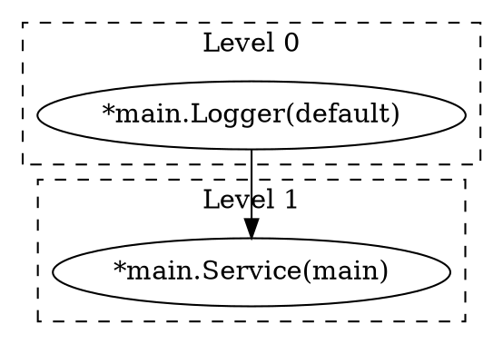

# Component: Type-Safe Dependency Lifecycle Orchestration for Go

Component is a lightweight library for declaring, validating, and orchestrating stateful application components (databases, queues, servers, workers).

The API is split into three explicit phases:

1. `Registry`: declare constructors and dependencies.
2. `Plan`: compile and validate a deterministic dependency graph.
3. `Runtime`: execute lifecycle start/stop.

## Features

- Type-safe component keys with Go generics.
- Explicit dependency graph with cycle and missing-dependency validation.
- Parallel `Start`/`Stop` within the same dependency level.
- Reverse-order shutdown by dependency level.
- Rollback on startup failure.
- Panic capture with contextual errors.

## Installation

```bash
go get github.com/jacoelho/component
```

## Quick Start

```go
package main

import (
	"context"
	"fmt"
	"log"
	"time"

	"github.com/jacoelho/component"
)

type Logger struct{}

func (l *Logger) Start(context.Context) error { fmt.Println("logger started"); return nil }
func (l *Logger) Stop(context.Context) error  { fmt.Println("logger stopped"); return nil }

type Service struct {
	logger *Logger
}

func (s *Service) Start(context.Context) error { fmt.Println("service started"); return nil }
func (s *Service) Stop(context.Context) error  { fmt.Println("service stopped"); return nil }

func main() {
	reg := component.NewRegistry()

	loggerKey := component.NewKey[*Logger]("default")
	serviceKey := component.NewKey[*Service]("main")

	if err := component.Provide(reg, loggerKey, func(_ *component.Runtime) (*Logger, error) {
		return &Logger{}, nil
	}); err != nil {
		log.Fatal(err)
	}

	if err := component.Provide(reg, serviceKey, func(rt *component.Runtime) (*Service, error) {
		logger, err := component.Get(rt, loggerKey)
		if err != nil {
			return nil, err
		}
		return &Service{logger: logger}, nil
	}, loggerKey); err != nil {
		log.Fatal(err)
	}

	plan, err := reg.Compile()
	if err != nil {
		log.Fatal(err)
	}

	rt := plan.NewRuntime()

	ctx, cancel := context.WithTimeout(context.Background(), 5*time.Second)
	defer cancel()

	if err := rt.Start(ctx); err != nil {
		log.Fatal(err)
	}
	defer rt.Stop(ctx)
}
```

See the runnable sample in [example/main.go](./example/main.go).

## Architecture

### Registry

`Registry` stores component declarations only.

```go
reg := component.NewRegistry()
err := component.Provide(reg, key, constructor, deps...)
```

### Plan

`Compile` validates and freezes the dependency graph.

```go
plan, err := reg.Compile()
```

Validation includes:
- Duplicate registration checks.
- Cycle detection.
- Missing dependency detection.

### Runtime

A `Runtime` is created from a compiled plan.

```go
rt := plan.NewRuntime()
err := rt.Start(ctx)
err = rt.Stop(ctx)
```

During constructors, dependencies can be resolved with:

```go
dep, err := component.Get(rt, depKey)
```

## Lifecycle Semantics

### Startup

- Components start by level (`0 -> N`).
- Components in the same level start concurrently.
- On failure, already-started components are rolled back.

### Shutdown

- Components stop in reverse level order (`N -> 0`).
- Components in the same level stop concurrently.
- Stop attempts continue even if some components fail.

## DOT Graph Output

A compiled plan can be exported to Graphviz DOT:

```go
dot := plan.DotGraph()
```

Example:


```dot
digraph G {
  rankdir=TB;
  compound=true;
  subgraph cluster_0 {
    label="Level 0";
    style=dashed;
    "*main.Logger(default)";
  }
  subgraph cluster_1 {
    label="Level 1";
    style=dashed;
    "*main.Service(main)";
  }
  "*main.Logger(default)" -> "*main.Service(main)";
}
```

## Development

```bash
make test
make staticcheck
```

## License

MIT
